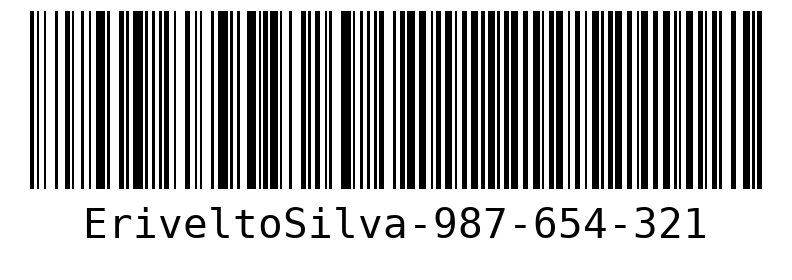

[MAINTENANCE_BADGE]: https://img.shields.io/badge/Maintained%3F-yes-green.svg
[PYTHON_BADGE]: https://img.shields.io/badge/python-3670A0?style=for-the-badge&logo=python&logoColor=ffdd54
[LICENSE_BADGE]: https://img.shields.io/pypi/l/ansicolortags.svg
[FLASK_BADGE]:https://img.shields.io/badge/flask-%23000.svg?style=for-the-badge&logo=flask&logoColor=white

<h1 align="center" style="font-weight: bold;"> flask-api-for-barcode-generator 💻</h1>

![Python][PYTHON_BADGE]
![Django][FLASK_BADGE]
![License][LICENSE_BADGE]
![Maintenance][MAINTENANCE_BADGE]

<p align="center">
    
</p>


`Content:`

<ul>
    <li><a href="#about">About</a></li>
    <li><a href="#features">Features</a></li>
    <li>
      <a href="#gettingStarted">Getting Started</a>
    </li>
    <li><a href="#howToRun">How To Run</a></li>
    <li><a href="#routes">API Endpoints</a></li>
    <li><a href="#collaborators">Collaborators</a></li>
    <li><a href="#contribute">Contribute</a></li>
    <li><a href="#license">License</a></li>
</ul>


<h2 id="about">📌 About</h2>

<p>
Automatic Barcode Generation API for Retail Stores and E-commerce Platforms
</p>

This API is developed using the Flask framework, adhering to best practices in scalable software design. Its core functionality provides an efficient solution for automated barcode generation, tailored to meet the needs of physical stores and e-commerce platforms. The application architecture is designed to be highly flexible and extensible, ensuring seamless integration with existing systems and scalability to accommodate business growth.
</p>

<h2 id="features">📄Features</h2>

- **Barcode Generation:** Automatically generate barcodes in multiple formats (e.g., Code 128, QR Code, EAN-13) based on user input, such as product ID or SKU.

- **Barcode Download Options:** Download generated barcodes as PNG, SVG, or PDF, ensuring flexibility in file type for various business needs.

- **API Authentication & Security:** Secure API endpoints with API key authentication to prevent unauthorized access and protect sensitive product data.

- **Detailed API Documentation:** Comprehensive API documentation with clear examples, allowing easy integration and use by developers.

- **Error Handling & Validation:** Built-in validation to ensure correct input formats and provide detailed error messages for invalid requests.


<h2 id="gettingStarted">🚀 Getting started</h2>

This section describes how you can run this project locally.


<h2 id="howToRun">🔗 How to Run</h2>

- Clone the project repository from GitHub:

```bash
git clone git@github.com:EriveltoSilva/flask-api-for-barcode-generator.git
```

- Navigate to the project directory and install the virtual environment:

```bash
cd flask-api-for-barcode-generator
virtualenv .venv
```

- Install the required dependencies:
```bash
pip install -r requirements.txt
```

- Start project
```bash
python run.py
```

- Server will be available in **http://127.0.0.1:3000/** and **http://your_local_ip_address:3000**

<h2 id="routes">📍 API Endpoint </h2>

Here is a comprehensive description of the primary API endpoints, along with the expected request bodies and responses for route.

<h3> Generate Barcode </h3>

| Route                                  | Description                                         |
|----------------------------------------|-----------------------------------------------------|
| <kbd> POST /create_tag</kbd>           | Generate barcode image                              |


<h3> POST /create_tag, valid json request body</h3>

**REQUEST BODY**
```json
{
    "product_code":"Erivelto Silva"
}
```

**RESPONSE**
```json
{
    "data": {
        "count": 1,
    "path": "barcodes/Erivelto Silva.png",
    "type": "Tag Image"
  }
}
```

<h3> POST /create_tag, invalid json request body - Empty Body</h3>

**REQUEST BODY**
```json
{

}
```

**RESPONSE**
```json
{
  "errors": [
    {
      "detail": {
        "product_code": [
          "required field"
        ]
      },
      "title": "UnprocessableEntity"
    }
  ]
}
```
<h3> POST /create_tag, invalid json request body - Wrong Body Request</h3>

**REQUEST BODY**
```json
{
  "test": "testing wrong fields"
}
```

**RESPONSE**
```json
{
  "errors": [
    {
      "detail": {
        "product_code": [
          "required field"
        ],
        "test": [
          "unknown field"
        ]
      },
      "title": "UnprocessableEntity"
    }
  ]
}
```

<p>

**Note:** :You can find all your barcode image generated in **./barcodes** folder in project root directory.

</p>

<h2 id="collaborators">🤝 Collaborators</h2>

Special thank you for all people that contributed for this project.

<table>
  <tr>
    <td align="center">
      <a href="https://erivelto-silva-portfolio.vercel.app/">
        <br>
        <sub>
          <b>Erivelto Silva</b>
        </sub>
      </a>
    </td>
  </tr>
</table>


<h2 id="contribute">📫 Contribute</h2>

1. `git clone https://github.com/EriveltoSilva/git@github.com:EriveltoSilva/flask-api-for-barcode-generator.git`
2. `git checkout -b feature/NAME`
3. Follow commit patterns
4. Open a Pull Request explaining the problem solved or feature made, if exists, append screenshot of visual modifications and wait for the review!


<h2 id="license"></h2>License</h2>

This project is licensed under the MIT License - see the <a href="./LICENSE.txt">LICENSE</a> file for details.